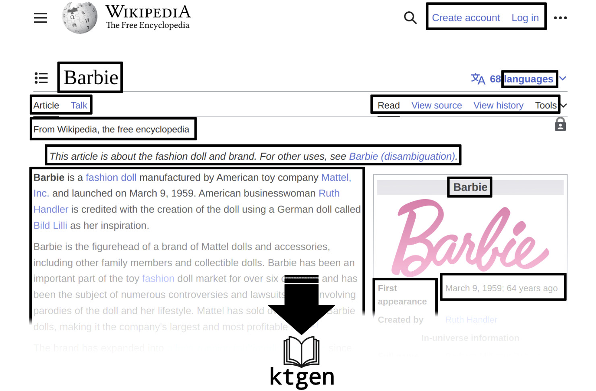
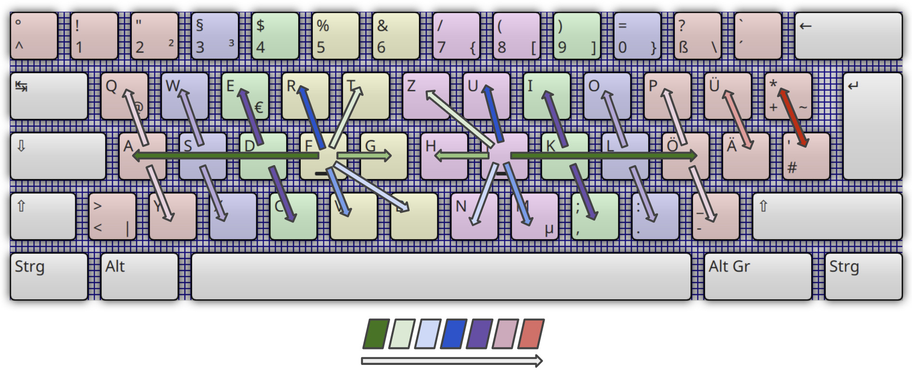

# ktgen

[KTouch](https://github.com/KDE/ktouch) Course Generator

[](https://hub.docker.com/repository/docker/barbiecue/ktgen/general)
[](https://codecov.io/gh/BarbieCue/ktgen)


## Overview

- Generate courses for keyboard layouts
- Generate custom courses
- Include local or online ressources
- Equip lessons with words from text files
- Or text scraped from websites of your choice
- Limit words length
- Individual lesson length
- Individual average line length


## Basic use

Generate a KTouch course in 3 simple steps.


### 1. Define your course

Use a [keyboard layout](#courses-for-keyboard-layouts) or create a custom course via [lesson specification](#lesson-specification).

```text
ab cd ef gh ij kl mn op qr st uv wx yz
AB CD EF GH IJ KL MN OP QR ST UV WX YZ
[sch] [ein] [ion]
WW,. WW!? WW:;
(WW) {WW} [WW] <WW>
"WW" 'WW' `WW`
~ +* #$ |& ^-
01 23 45 67 89
```


### 2. Run ktgen

```shell
docker run --rm barbiecue/ktgen:latest \
"ab cd ef gh ij kl mn op qr st uv wx yz" \
"AB CD EF GH IJ KL MN OP QR ST UV WX YZ" \
"[sch] [ein] [ion]" \
"WW,. WW\!? WW:;" \
"(WW) {WW} [WW] <WW>" \
"\"WW\" 'WW' \`WW\`" \
"~ +* #$ |& ^-" \
"01 23 45 67 89" -o > ktgen_course.xml
```


### 3. Done

Your KTouch course has been generated and written to `ktgen_course.xml`.
You can import it into KTouch.

### Example with keyboard layout

A course for the *german neo 2 keyboard layout* referenced by GitHub link,
 containing words from the website *https://de.wikipedia.org/wiki/Ameisen*,
 written to the file *ktgen_course.xml*.

 ```shell
 docker run --rm barbiecue/ktgen:latest \
 https://raw.githubusercontent.com/KDE/ktouch/master/data/keyboardlayouts/de.neo2.xml \
 -web https://de.wikipedia.org/wiki/Ameisen \
 -o > ktgen_course.xml
 ```

Have a look at the **[examples](#examples)** section for more.


## Dictionary

Provide dictionaries to **add words to your course**.
The first lessons are mostly generated with random combinations of letters,
because there are not enough letters to find meaningful words.
As the number of letters increases, more and more words can be found.
The word order will be preserved by default, making it possible to build
meaningful **sentences** automatically.

There are two ways to equip *ktgen* with a dictionary. They can be combined with each other.


### Text file

Use `-file <path>` to point to a dictionary file.
No matter if it contains continuous text or one word per line.

```shell
docker run --rm -v $PWD/:/files barbiecue/ktgen:latest /files/lesson_specification.ktgen -file /files/README.md -o > ktgen_course.xml
```


### Website

Link a website of your choice with `-web <url>` and let *ktgen*
extract text from it.

```shell
docker run --rm -v $PWD/:/files barbiecue/ktgen:latest /files/lesson_specification.ktgen \
-web https://en.wikipedia.org/wiki/Barbie -o > ktgen_course.xml
```




## Lesson specification

As mentioned above, the lesson specification describes the lessons for your course.
The following format applies here.


### Separation with whitespace characters

Each segment separated by whitespace characters defines new symbols
for which lessons are generated. The read order is left to right and top down.
It can be a single line.

```text
ab cdef gh
AB
CD
EFGH
123
,.
```

Here we have 8 segments of new symbols to learn: `ab`, `cdef`, `gh`, `AB`, `CD`, `EFGH`, `123`, `,.`.


#### This example leads to the following lessons:

- Random permutations of `ab`
- Random permutations of `ab` mixed with words consisting of `ab`
- Words consisting of `ab`
- Random permutations of `cdef`
- Random permutations of `cdef` mixed with words consisting of `abcdef` where each
   word contains at least one of the symbols `cdef`
- Such words only
- Random permutations of `gh`
- Random permutations of `gh` mixed with words consisting of `abcdefgh` where each
   word contains at least one of the symbols `gh`
- Such words only
- So on for `AB`, `CD` and `EFGH`
    ...
- Random permutations of `123`
- Random permutations of `,.`
- Words consisting of `abcdefghABCDEFGH` where `,` or `.` is prefixed or appended randomly

In between, additional summary lessons are generated for the last 3 segments of new symbols to be learned.

##### However
- No word lessons are generated if no matching words can be found in the dictionary
- Some lessons might be optimized out when they are too similar or when they are not diverse enough


### Allowed symbols

Allowed symbols are `A-Z`, `ÄÖÜ`, `ß` in lowercase and uppercase, `0-9`
and `!"#$%&'()*+,-./:;<=>?@[]^_{|}~\`.


### Punctuation marks

If the side does not matter so that a punctuation mark can be to the left or to the right of the word,
you can just write it down.

```text
\/ +- ,;
```

This leads to lessons containing words like `\pear`, `barbie/`, `+pear`, `-apple`, `,barbie`, `pear;`.

But, if the side matters, so that the punctuation mark can only be
to the left or only to the right of a word, then use the `WW` pattern (*WW* stands for *word*).

```text
WW., [(WW)] {WW}
```

This leads to lessons containing words like `(pear)`, `[barbie]`, `{pear}`, `apple.`, `barbie,`.


### Letter groups

In most languages, some letters often appear in fixed groups.
For example, *"ion"*, *"ss"*, *"ch"*, *"ght"* or *"sch"*.
Lessons for such groups are generated with _square brackets_.

```text
[ch] [tt] [ion] [ght]
```

This leads to lessons containing words like `china`, `chemie`, `letter`, `mission`, `compression`, `eight`, `fight`.


## Courses for keyboard layouts

Let _ktgen_ generate courses for a keyboard layout of your choice.

Such a course consists of finger-to-finger lessons that focus on the key neighbors.
This results in an intuitive path through the layout,
which begins with the basic finger position.



The [input](#input) section explains how to instruct *ktgen* to generate courses for keyboard layouts.


## Combining lesson specifications

Multiple lesson specifications can be combined to a single course, simply by passing them as arguments to *ktgen*.
They are applied in order. For example:

```shell
docker run --rm -v $PWD/:/files barbiecue/ktgen:latest \
https://raw.githubusercontent.com/BarbieCue/ktgen/main/lesson_specification.ktgen \
/files/docs/examples/german-layout.xml \
"[ion] [sh] [str] [sch]" -o > ktgen_course.xml
```

- The first lessons are generated from *lesson_specification.ktgen*
- Lessons mapping the german keyboard layout follow
- At the end of the course are lessons for the letter groups

When running *ktgen* locally via Java,
the specification file `lesson_specification.ktgen` is used as default input,
if no lesson specification is passed as argument.
With docker, you always have to pass a lesson specification (see [input](#input)).


## Input

There are different ways to input lesson specifications.


### String arguments

Specify a custom course definition as program argument(s).
Remember to escape appropriate characters so that they are not interpreted by the shell.

```shell
docker run --rm barbiecue/ktgen:latest "ab cd ef 12 34 WW?\!" -o > ktgen_course.xml
```


### Files

#### A *ktgen* lesson specification file passed via bind mount

```shell
docker run --rm -v $PWD/:/files barbiecue/ktgen:latest /files/lesson_specification.ktgen -o > ktgen_course.xml
```

#### A keyboard XML file passed via bind mount

1. Export a keyboard layout from KTouch (e.g `german-layout.xml`)
2. Pass it as argument to *ktgen*

```shell
docker run --rm -v $PWD/docs/examples/:/files barbiecue/ktgen:latest /files/german-layout.xml -o > ktgen_course.xml
```


### Web

Simply reference a *ktgen* lesson specification or a keyboard XML via HTTP URL.
The URL must start with `http` or `https`. Make sure that the response is plain text.

#### A *ktgen* lesson specification via HTTP link

The URL must end with `.ktgen`.
For example, use the **Raw** version of the GitHub *ktgen* `lesson_specification.ktgen` file.

```shell
docker run --rm barbiecue/ktgen:latest https://raw.githubusercontent.com/BarbieCue/ktgen/main/lesson_specification.ktgen -o > ktgen_course.xml
```

#### A keyboard layout via HTTP link

The URL must end with `.xml`.
For example, use one of the official KTouch keyboard layouts from GitHub: https://github.com/KDE/ktouch/tree/master/data/keyboardlayouts.
Make sure to reference the **Raw** version.

```shell
docker run --rm barbiecue/ktgen:latest https://raw.githubusercontent.com/KDE/ktouch/master/data/keyboardlayouts/de.neo2.xml -o > ktgen_course.xml
```


## Output

You can write the course to stdout `-o` or to a file `-of <file>` or to both.
The course will be written to the `ktgen_course.xml` file by default if none of the options are set.
However, this file remains in the docker container.
Consequently `-of <file>` may be useful when running *ktgen* locally via Java.


## Examples

-   A course for the lesson specification file of the *ktgen* GitHub Repository referenced by link,
    containing words from the website *https://en.wikipedia.org/wiki/Computational_complexity_theory*,
    written to the file *ktgen_course.xml*.

    ```shell
    docker run --rm barbiecue/ktgen:latest \
    https://raw.githubusercontent.com/BarbieCue/ktgen/main/lesson_specification.ktgen \
    -web https://en.wikipedia.org/wiki/Computational_complexity_theory \
    -o > ktgen_course.xml
    ```

-   A course for the *lesson specification* passed as string argument,
    containing words from the website *https://en.wikipedia.org/wiki/Barbie*,
    written to the file *ktgen_course.xml*.

    ```shell
    docker run --rm barbiecue/ktgen:latest \
    "ab cd ef gh ij kl mn op qr st uv wx yz" \
    -web https://en.wikipedia.org/wiki/Barbie \
    -o > ktgen_course.xml
    ```


The following examples include sample input files and work immediately when you check out this repository and navigate into it.

-   A course that starts with lessons for *letters.ktgen* and ends with lessons for *digits.ktgen*
    written to *ktgen_course.xml*.

    ```shell
    docker run --rm -v $PWD/docs/examples/:/files \
    barbiecue/ktgen:latest /files/letters.ktgen /files/digits.ktgen \
    -o > ktgen_course.xml
    ```

-   A course with lessons from *letters.ktgen* containing words from the file
    *mydict.txt* and from the website *https://docs.dagger.io/* written to *ktgen_course.xml*.

    ```shell
    docker run --rm -v $PWD/docs/examples/:/files \
    barbiecue/ktgen:latest /files/letters.ktgen \
    -file /files/mydict.txt \
    -web https://docs.dagger.io/ \
    -o > ktgen_course.xml
    ```

-   A course for the german keyboard layout containing words from the website _https://de.wikipedia.org/wiki/Ameisen_
    written to *ktgen_course.xml*.

    ```shell
    docker run --rm -v $PWD/docs/examples/:/files \
    barbiecue/ktgen:latest /files/german-layout.xml \
    -web https://de.wikipedia.org/wiki/Ameisen \
    -o > ktgen_course.xml
    ```

-   A course for the german keyboard layout containing words from the website _https://de.wikipedia.org/wiki/Ameisen_
    where each word is max 10 characters long and each lesson has a length of 500 characters.
    Written to *ktgen_course.xml*.

    ```shell
    docker run --rm -v $PWD/docs/examples/:/files \
    barbiecue/ktgen:latest /files/german-layout.xml \
    -web https://de.wikipedia.org/wiki/Ameisen \
    -max 10 \
    -length 500 \
    -o > ktgen_course.xml
    ```

-   A course for the german keyboard layout written to the file *my_ktouch_course.xml*.

    ```shell
    docker run --rm -v $PWD/docs/examples/:/files \
    barbiecue/ktgen:latest /files/german-layout.xml \
    -o > my_ktouch_course.xml
    ```

-   A course for *lesson_specification.ktgen* written to stdout.

    ```shell
    docker run --rm -v $PWD/lesson_specification.ktgen:/files/lesson_specification.ktgen \
    barbiecue/ktgen:latest /files/lesson_specification.ktgen -o
    ```


## Help

```shell
docker run --rm barbiecue/ktgen:latest --help
```


## Build

Requires Java 17 or higher

```shell
./gradlew buildFatJar
```
```shell
docker build -t ktgen .
```
